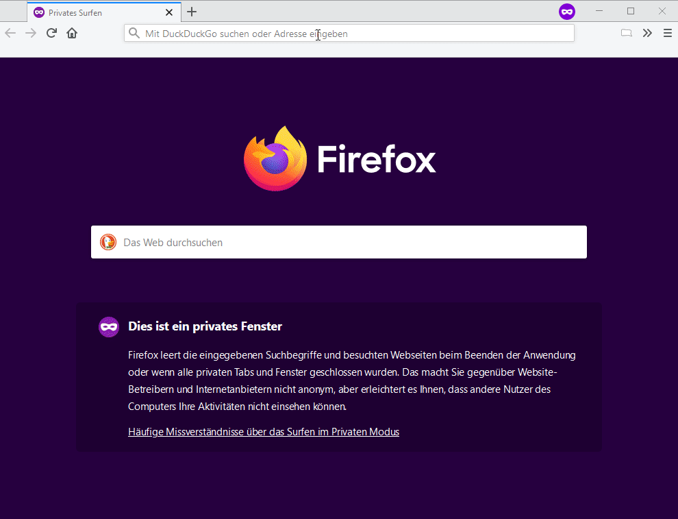

## Commenter web-extension

An extendable web-extension that reads the URL you're visiting and searches other submissions of it on other websites. Like this:

### Now, what would you use that for?

Different communities discuss things differently. Different ideas, different tone, different experiences. Use it to expand your learning starting from one link.

Or maybe you've found an article you'd like to share. Use this extension to see if it's already been posted. 

**Currently supported sources:** HackerNews and Reddit.

**Currently supported browsers:** This extension has been developed on Firefox and extended to work on Chromium-based browsers. 
It has been tested on Chrome and Edge. It should also work in Opera.
 
### Download

### Want to extend it and more sources? Cool! Here's how
Steps:
1. Of course, you need to fork the repo.
2. Read a guide about web-extensions to see how they work (totally optional)
3. Go to the _tests/observers_ folder and copy one of the tests, rename it, run it and TDD the hell out of it
4. Go to _src/observers_ and add your observer. Look at the other ones for examples, they're pretty straight forward
5. Oh yeah, do a _npm --install_ on the folder. _webpack --watch --mode development_ for live updating the exported code.
Run tests with _npm run test_. _web-ext run_ to run the extension in Firefox.

Then, do a merge request and I'll merge it. I might even review it first.

